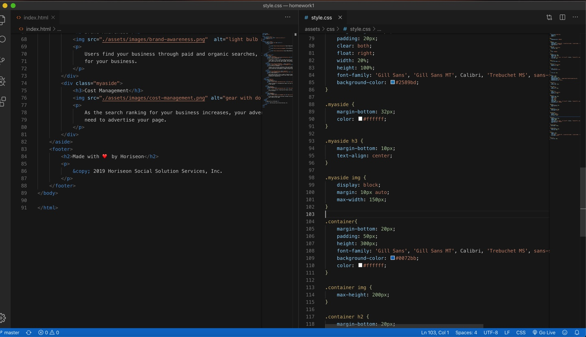

# homework1
## Homework: Code Refactor
Take the provided codebase and refactor it to make it accessible
here's the link my project deployed. https://github.com/setaremehr/homework1/tree/master

# I did clean up the css code and some changes on html 
#I did not add any additional code 
#I did not any changes on view of the web site 
#here's some screenshots of my finished product

#.   

